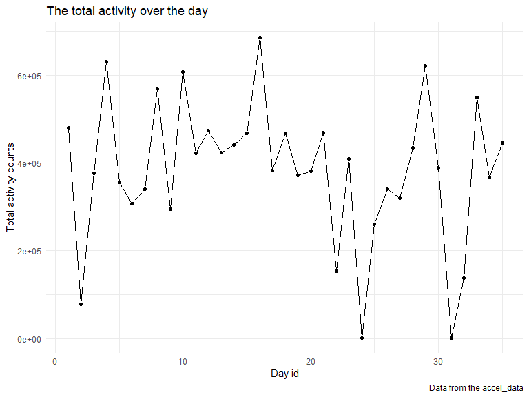
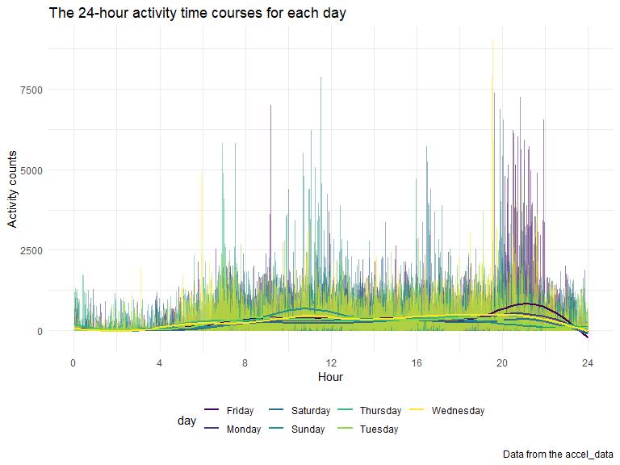
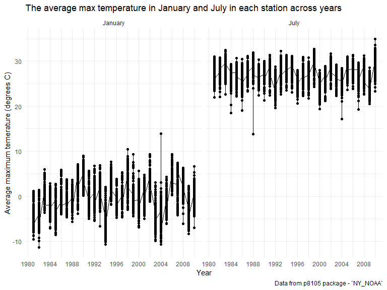

p8105_hw3_yx2711
================
Yingchen Xu
2022-10-15

# Problem 1

Load dataset `instacart`

``` r
data("instacart")

instacart = instacart %>%
  as_tibble(instacart) %>% 
  janitor::clean_names()
```

There are 1384617 rows and 15 columns in the `instacart` dataset, with
each row representing one product of the order. Key variables include
order details (order number, order time, etc), user id and product
detail (product id, product name, products’ departments). In total,
there are 39123 products found in 131209 orders from 131209 distinct
users.

Count number of aisles and identify which aisles are the most items
ordered from.

``` r
instacart %>% 
  select(aisle) %>% 
  distinct %>% 
  count()
```

    ## # A tibble: 1 × 1
    ##       n
    ##   <int>
    ## 1   134

``` r
instacart %>% 
  group_by(aisle) %>% 
  summarize(obs = n()) %>% 
  arrange(desc(obs))
```

    ## # A tibble: 134 × 2
    ##    aisle                            obs
    ##    <chr>                          <int>
    ##  1 fresh vegetables              150609
    ##  2 fresh fruits                  150473
    ##  3 packaged vegetables fruits     78493
    ##  4 yogurt                         55240
    ##  5 packaged cheese                41699
    ##  6 water seltzer sparkling water  36617
    ##  7 milk                           32644
    ##  8 chips pretzels                 31269
    ##  9 soy lactosefree                26240
    ## 10 bread                          23635
    ## # … with 124 more rows

There are 134 aisles and fresh vegetables and fresh fruits have the most
orders.

Make a plot that shows the number of items ordered in each aisle,
arrange and organize.

``` r
instacart %>% 
  count(aisle) %>% 
  filter(n > 10000) %>% 
  mutate(aisle = fct_reorder(aisle, n)) %>% 
  ggplot(aes(x = aisle, y = n)) + 
  geom_point() + 
  labs(title = "Number of items ordered in each aisle") +
  theme(axis.text.x = element_text(angle = 60, hjust = 1))
```


Make a table showing the three most popular items in each of the aisles
“baking ingredients”, “dog food care’, and”packaged vegetables fruit.”

``` r
instacart %>% 
  filter(aisle %in% c("baking ingredients", "dog food care", "packaged vegetables fruits")) %>%
  group_by(aisle) %>% 
  count(product_name) %>% 
  mutate(rank = min_rank(desc(n))) %>% 
  filter(rank < 4) %>% 
  arrange(desc(n)) %>%
  knitr::kable()
```

| aisle                      | product_name                                  |    n | rank |
|:---------------------------|:----------------------------------------------|-----:|-----:|
| packaged vegetables fruits | Organic Baby Spinach                          | 9784 |    1 |
| packaged vegetables fruits | Organic Raspberries                           | 5546 |    2 |
| packaged vegetables fruits | Organic Blueberries                           | 4966 |    3 |
| baking ingredients         | Light Brown Sugar                             |  499 |    1 |
| baking ingredients         | Pure Baking Soda                              |  387 |    2 |
| baking ingredients         | Cane Sugar                                    |  336 |    3 |
| dog food care              | Snack Sticks Chicken & Rice Recipe Dog Treats |   30 |    1 |
| dog food care              | Organix Chicken & Brown Rice Recipe           |   28 |    2 |
| dog food care              | Small Dog Biscuits                            |   26 |    3 |

Make a table showing the mean hour the day at which Pink Lady Apples and
Coffee Ice Cream are ordered on each day of the week

``` r
instacart %>%
  filter(product_name %in% c("Pink Lady Apples", "Coffee Ice Cream")) %>%
  group_by(product_name, order_dow) %>%
  summarize(mean_hour = mean(order_hour_of_day)) %>%
  spread(key = order_dow, value = mean_hour) %>%
  knitr::kable(digits = 2)
```

    ## `summarise()` has grouped output by 'product_name'. You can override using the
    ## `.groups` argument.

| product_name     |     0 |     1 |     2 |     3 |     4 |     5 |     6 |
|:-----------------|------:|------:|------:|------:|------:|------:|------:|
| Coffee Ice Cream | 13.77 | 14.32 | 15.38 | 15.32 | 15.22 | 12.26 | 13.83 |
| Pink Lady Apples | 13.44 | 11.36 | 11.70 | 14.25 | 11.55 | 12.78 | 11.94 |

# Problem 2

Read file and clean names. Use `mutate()` to add a type variable to
indicate that whether the day is a weekend or a weekday. Use
`Pivot_longer()` to transform the dataset from the wide format to a long
format and name the columns as “activity_id” and “counts”

``` r
activity = read.csv("data/accel_data.csv") %>% 
  janitor::clean_names() %>% 
  mutate(
    type = ifelse(day == c("Saturday", "Sunday"), "weekend", "weekday")
  ) %>% 
  pivot_longer(
    activity_1:activity_1440,
    names_to = "minute",
    names_prefix = "activity_",
    values_to = "counts"
  )
```

The dataset `activity` contains 50400 observations and 6 variables. The
variables are week, day_id, day, type (indicating whether it is a
weekday or weekend), minute, and activity counts.

Use `knitr::kable()` to create a table showing the total activity for
each day. Also create a scatterplot to see whether there is a trend.

``` r
activity %>% 
  group_by(day_id) %>% 
  summarize(sum_counts = sum(counts, na.rm = TRUE)) %>% 
  knitr::kable(digits = 2)
```

| day_id | sum_counts |
|-------:|-----------:|
|      1 |  480542.62 |
|      2 |   78828.07 |
|      3 |  376254.00 |
|      4 |  631105.00 |
|      5 |  355923.64 |
|      6 |  307094.24 |
|      7 |  340115.01 |
|      8 |  568839.00 |
|      9 |  295431.00 |
|     10 |  607175.00 |
|     11 |  422018.00 |
|     12 |  474048.00 |
|     13 |  423245.00 |
|     14 |  440962.00 |
|     15 |  467420.00 |
|     16 |  685910.00 |
|     17 |  382928.00 |
|     18 |  467052.00 |
|     19 |  371230.00 |
|     20 |  381507.00 |
|     21 |  468869.00 |
|     22 |  154049.00 |
|     23 |  409450.00 |
|     24 |    1440.00 |
|     25 |  260617.00 |
|     26 |  340291.00 |
|     27 |  319568.00 |
|     28 |  434460.00 |
|     29 |  620860.00 |
|     30 |  389080.00 |
|     31 |    1440.00 |
|     32 |  138421.00 |
|     33 |  549658.00 |
|     34 |  367824.00 |
|     35 |  445366.00 |

``` r
plot_total = activity %>% 
  group_by(day_id) %>% 
  summarize(sum_counts = sum(counts)) %>%
  ggplot(aes(x = day_id, y = sum_counts)) +
  geom_point() +
  geom_line() +
  labs(
    title = "The total activity over the day",
    x = "Day id",
    y = "Total activity counts",
    caption = "Data from the accel_data")

plot_total
```



By observing the table and the plot, it seems that there is no apparent
trend between total activity and day_id.

Make a single-panel plot that shows the 24-hour activity time courses
for each day and use color to indicate day of the week. Use
`geom_line()` to show the overall trend and use `geom_smooth()` to
indicate variations within each day of a week.

``` r
plot_each_day = activity %>% 
  mutate(hour = as.numeric(minute) / 60) %>% 
  ggplot(aes(x = hour, y = counts, color = day)) +
  geom_line(alpha = 0.5) +
  geom_smooth(se = FALSE) +
  labs(
    title = "The 24-hour activity time courses for each day",
    x = "Hour",
    y = "Activity counts",
    caption = "Data from the accel_data") +
  scale_x_continuous(breaks = c(0, 4, 8, 12, 16, 20, 24))

plot_each_day
```

    ## `geom_smooth()` using method = 'gam' and formula 'y ~ s(x, bs = "cs")'



Based on the overall graph, we can observe that the overall activity
counts are low from 0 am to around 5 am. The activity counts start to
increase from 5 am to 9 am and has a peak around 7 am. Then the activity
counts stay high and constant from 10 am to around 11 pm. Based on the
`geom_smooth()`, we can observe there are differences between each day
of a week. There is a distinct peak at around 10 am for Sunday and there
is a distinct peak at around 10 pm for Friday.

# Problem 3

Load dataset `ny_noaa`.

``` r
data("ny_noaa")

ny_noaa = ny_noaa %>% 
  as_tibble(ny_noaa) %>% 
  janitor::clean_names()
```

The `ny_noaa` dataset contains 2595176 rows and 7 columns. The key
variables are weather station id, date, precipitation, snowfall, snow
depth, maximum temperature and minimum temperature. There are 145838
missing values in the precipitation variables, 381221 missing values in
the snow fall variables, 591786 missing values in the snow depth
variables, 1134358 missing values in the maximum temperature variables
and 1134420 missing values in the minimum temperature variables.

Create separate variables for year, month, and day and ensure
observations for temperature, precipitation, and snowfall are given in
reasonable units.

``` r
ny_noaa = ny_noaa %>% 
  separate(date, c("year", "month", "day")) %>% 
  mutate(
    prcp = prcp / 10,
    tmax = as.numeric(tmax) / 10,
    tmin = as.numeric(tmin) / 10,
    year = as.numeric(year),
    month = as.numeric(month),
    day = as.numeric(day)
  )

ny_noaa %>% 
  group_by(snow) %>% 
  summarize(n = n()) %>% 
  arrange(desc(n))
```

    ## # A tibble: 282 × 2
    ##     snow       n
    ##    <int>   <int>
    ##  1     0 2008508
    ##  2    NA  381221
    ##  3    25   31022
    ##  4    13   23095
    ##  5    51   18274
    ##  6    76   10173
    ##  7     8    9962
    ##  8     5    9748
    ##  9    38    9197
    ## 10     3    8790
    ## # … with 272 more rows

The date variable has been separated into three variables year, month
and day. The units of precipitation has changed to mm and the units of
tmax and tmin has changed to degrees C. The most commonly observed value
for snowfall is 0. Since snowfall only occurs in the winter and for the
rest of the year, the occurrence of snowfall would be 0.

Make a two-panel plot showing the average max temperature in January and
in July in each station across years.

``` r
plot_Jan_vs_Jul = ny_noaa %>% 
  filter(
    month == c(1, 7),
    !is.na(tmax)) %>% 
  mutate(
    month = recode(month, "01" = "January", "07" = "July")
  ) %>% 
  group_by(id, month, year) %>% 
  summarize(avg_max = mean(tmax)) %>% 
  ggplot(aes(x = year, y = avg_max)) +
  geom_point() +
  geom_line() +
  facet_grid(.~month) +
  labs(
    title = "The average max temperature in January and July in each station across years",
    x = "Year",
    y = "Average maximum temerature (degrees C)",
    caption = "Data from p8105 package - `NY_NOAA`"
  ) + 
  scale_x_continuous(n.break = 10)
```

    ## `summarise()` has grouped output by 'id', 'month'. You can override using the
    ## `.groups` argument.

``` r
plot_Jan_vs_Jul
```



The overall average maximum temperature is higher in July in each
station across years than in January. There are fluctuations in average
maximum temperature in each station over the years in these two months.
In each year, the ranges of average maximum temperatures in each station
are smaller in July than in January on average. There are outliers. For
example, in January 2004, there is one station that has average maximum
temperature of 14 degrees C, which is much higher than the rest in
January. In July 1988, there is one station that has average maximum
temperature of around 14 degrees C, which is much lower than the rest in
July.
